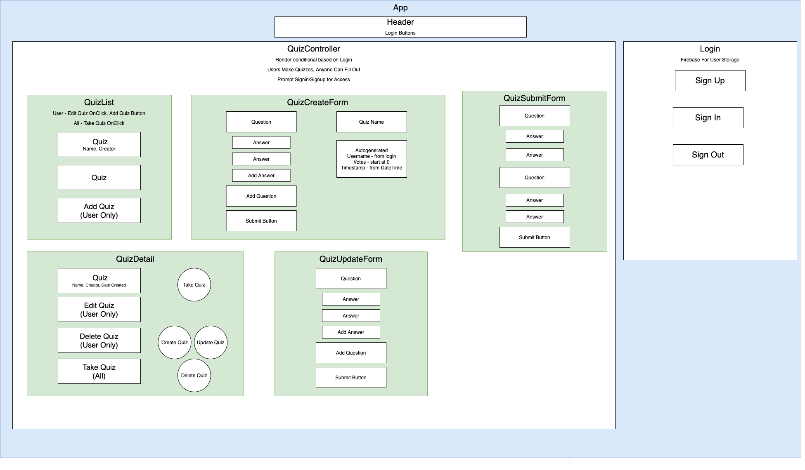

# **Quiz Maker**

#### Author: **Jessica Hvozdovich and Chee Murakami**
#### July 14, 2020

### Description

_This application uses React, Redux, and Firebase/Firestore to allow users to create and take quizzes. The quiz maker app has login functionality, full CRUD functionality regarding quizzes, form inputs for users taking quizzes, all of which are stored in a Firestore database._

### Instructions for use:

1. Open Terminal (macOS) or PowerShell (Windows)
2. To download the project Directory to your desktop enter the following commands:
```
cd Desktop
git clone https://github.com/jhvozdovich/react-quiz-maker
cd reqct-quiz-maker
```
3. To view the downloaded files, open them in a text editor or IDE of your choice.
* if you have VSCode for example, when your terminal is within the main project Directory you can open all of the files with the command:
```
code .
```
5. Download node and node package manager if they are not already installed on your device. You can find further instructions [here](https://www.learnhowtoprogram.com/intermediate-javascript/getting-started-with-javascript-8d3b52cf-3755-481d-80c5-46f1d3a8ffeb/installing-node-js-14f2721a-61e0-44b3-af1f-73f17348c8f4).
5. Run npm install in your terminal to download the necessary dependencies, plugins, and modules.
```
npm install
```
6. The command npm run start will build and open the compiled code in a browser of your choice using a local host.
```
npm run start
```

### Known Bugs

No bugs have been identified at the time of this update.

### Support and Contact Information

Please contact me with any suggestions or questions at jhvozdovich@gmail.com. Thank you for your input!  
_Have a bug or an issue with this application? [Open a new issue](https://github.com/jhvozdovich/react-quiz-maker/issues) here on GitHub._

### Technologies Used

* JavaScript
* React
* Redux
* Firebase/Firestore
* JSX
* HTML
* Git and GitHub



### Specs
| Spec | Input | Output |
| :------------- | :------------- | :------------- |
| **User can view list of quizzes** | User Input:"Link:"/" for home" | Output: “Quiz List is displayed" |
| **User can navagate to a quiz create form** | User Input:"Click: Make Quiz" | Output: “Quiz Form is displayed" |
| **User can create a quiz** | User Input:"Fill Out Questions and Responses, Add Quiz" | Output: "Quiz List is displayed with new quiz" |
| **User can view quiz details and options** | User Input:"Click Quiz" | Output: "Quiz Details and Edit/Delete/Take Quiz options are displayed" |
| **User can update a quiz** | User Input:"Click Quiz, Click Edit Quiz" | Output: “Quiz Edit Form is displayed" |
| **User can delete a quiz** | User Input:"Click Quiz, Click Delete Quiz" | Output: “Quiz is Removed" |
| **User can take a quiz** | User Input:"Click Quiz, Click Take Quiz" | Output: “Quiz is displayed" |
| **User can navigate to login page** | User Input:"Click: Login" | Output: “Login Page is displayed" |
| **User can sign up** | User Input:"Click Login, Click Sign Up" | Output: “Sign Up form is displayed" |
| **User can sign in** | User Input:"Click Login, Click Sign In" | Output: “Sign In is displayed" |
| **User can sign out** | User Input:"Click Login, Click Sign Out" | Output: “User is logged out and returned to quiz list" |
| **Only signed in users can create quizes** | User Input:"Not signed in, click quiz list" | Output: “Add quiz button is not displayed" |
| **Only signed in users can update or delete quizes** | User Input:"Not signed in, click quiz details" | Output: “Update and delete buttons are not displayed" |


### Stretch Goals
* Admin users for quiz creation, start with all signed in users having CRUD ability 
* User dashboard of quizzes they created and past results
* Combined data view for survey results
* Library for data vis (D3)
* Are you sure? Display before deleting.
* Login and Logout displayed with username/guest in nav bar depending on auth

#### License

This software is licensed under the MIT license.

Copyright © 2020 **_Jessica Hvozdovich and Chee Murakami_**
